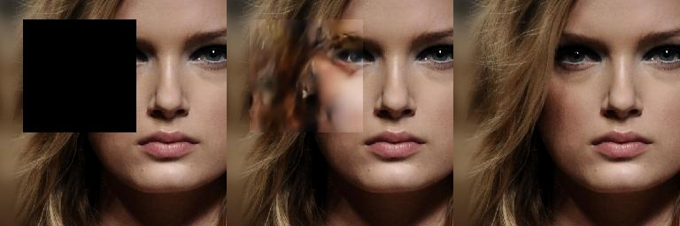
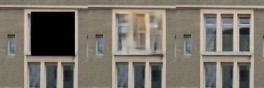

# Globally and Locally Consistent Image Completion in pytorch

```
  "Globally and Locally Consistent Image Completion"
  Satoshi Iizuka, Edgar Simo-Serra, and Hiroshi Ishikawa
  ACM Transaction on Graphics (Proc. of SIGGRAPH 2017), 2017
```

This is an implementation of the image completion model proposed in the paper
([Globally and Locally Consistent Image Completion](
http://hi.cs.waseda.ac.jp/%7Eiizuka/projects/completion/data/completion_sig2017.pdf))
in Pytorch 0.4.


# Requirements

- Python 3
- Pytorch 0.4
- TensorbardX
- argparser
- etc (PIL, tqdm...)

# Usage

## I. Prepare the training data
 This step is pre-pocessing of the image (make random mask)
 and transform image to torch tensor.
```
$ cd src_gl
$ python prepare_dataset2tensor.py
```

in github. I already uploaded "Facade dataset" with test and train.
You can put any of datasets in data folder

And also you can change image size, maske size, maske margine
```
$ python prepare_dataset2tensor.py --patchSize 256 --patchSize 128 --boundary_margin 8
```
## II. Train model

Train the "GL" model with pre-processed tensor data in step I.
```
$ cd src_gl
$ python train.py
```
## III. Evaluate model
```
$ cd src_gl
$ python eval.py
```

# Result




# Related works
- Author Code (https://github.com/satoshiiizuka/siggraph2017_inpainting)
 - GLCIC in tnesorflow (https://github.com/tadax/glcic)
 - Code Base (https://github.com/pytorch/examples/tree/master/super_resolution)
 
# Citation
Please cite the original paper in your publications:
```
@Article{IizukaSIGGRAPH2017,
  author = {Satoshi Iizuka and Edgar Simo-Serra and Hiroshi Ishikawa},
  title = {{Globally and Locally Consistent Image Completion}},
  journal = "ACM Transactions on Graphics (Proc. of SIGGRAPH)",
  year = 2017,
  volume = 36,
  number = 4,
  pages = 107:1--107:14,
  articleno = 107,
}
```
 
#Implementation Author
 chankyoo.moon / [@dreamegg](https://github.com/dreamegg)
